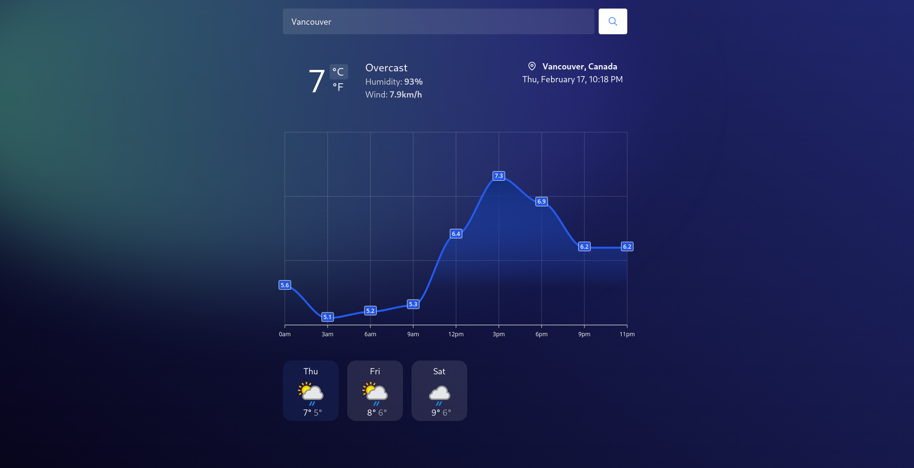

# A simple weather website

I used [this](https://weatherapi.com) free API to make a practice project with React and TailwindCSS. It is available [online](https://rasuru-weather.herokuapp.com/).

## Get started

- Get a free API key on [WeatherAPI](https://weatherapi.com)
- `git clone https://github.com/rasuru/weather.git`
- Create an empty `.env` file in `/backend`, copy `/backend/.env.example` contents into it, and fill in all of the fields.
- `cd /backend && yarn i && yarn start`
- `cd /frontend && yarn i && yarn start` in another terminal instance
- Open `http://localhost:3000` in browser

## License

[GPL-3.0](https://opensource.org/licenses/GPL-3.0)
